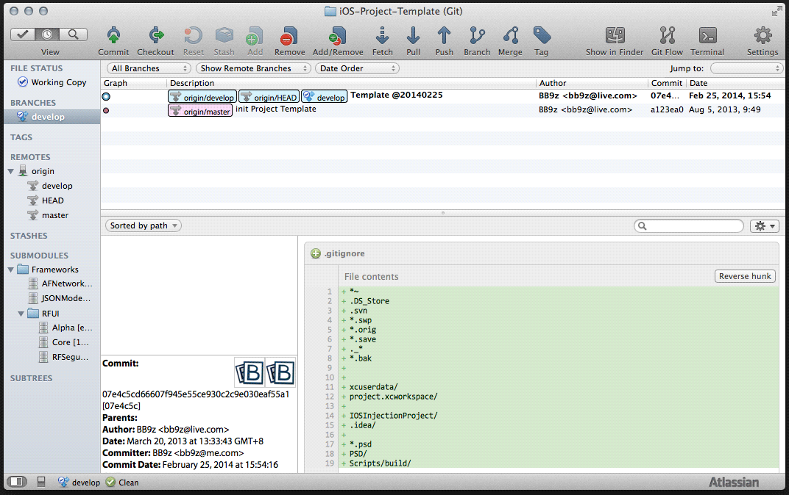
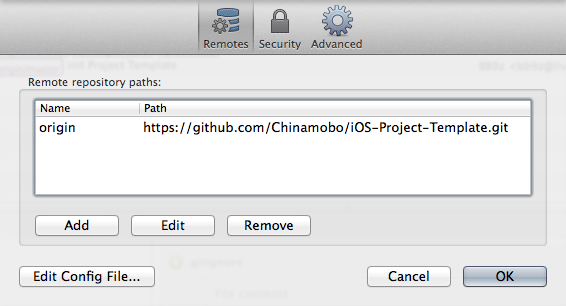
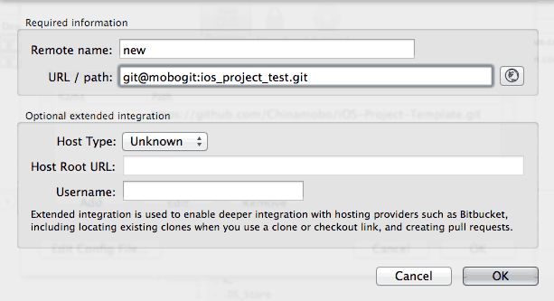

Chinamobo iOS 项目模版使用指南
=====

获取模版并推到新的仓库
----
其实也没什么好说的，就是拿下来推到另一个地址。推荐的做法：

1. 先用 git 把仓库 clone 下来，正式仓库地址是 `https://github.com/Chinamobo/iOS-Project-Template.git`，用 SourceTree 的可参考下图：

    

    拿下来后可能是这个样子：
    
    

2. 点击右上角的 Settings，会显示仓库 Remote 菜单：

    
    
    点添加把新的仓库添加进去，如下图所示：
    
    

3. 把 master 和 develop 分支 push 到新的 remote，[动画演示](Guide/sourcetree_push_to_new_remote_animation.gif)

4. 建议从目标仓库重新 clone，切到 develop 分支开始开发

这个仓库可以本地留一份，以后直接更新再 push 到新的 remote 就可以了。


项目组织
----

下面是项目中各目录存放内容的说明：

```
├── App                     应用开发的主目录
│   ├── General          全局资源、项目级别的复用组件
│   ├── Launching        应用启动过程
│   ├── Model            数据模型、Core Data Stack
│   ├── Networking       网络请求组件和相关插件
│   ├── Scene            各种业务视图都放在这里
│   ├── Service          全局变量中心和第三方服务的封装
│   ├── Scene            各种业务视图都放在这里
│   └── Supporting Files debug.h 调试开关，其他项目文件
├── AppTests                测试相关的东西
├── Frameworks              公共库、第三方库都应该放在这里
└── Scripts                 辅助脚本
```

修改全局颜色
----
General/Appearance 目录下的很多外观控件依赖于全局颜色，你需要修改 UIKit+App 和 Storyboard 中的全局颜色设置。
